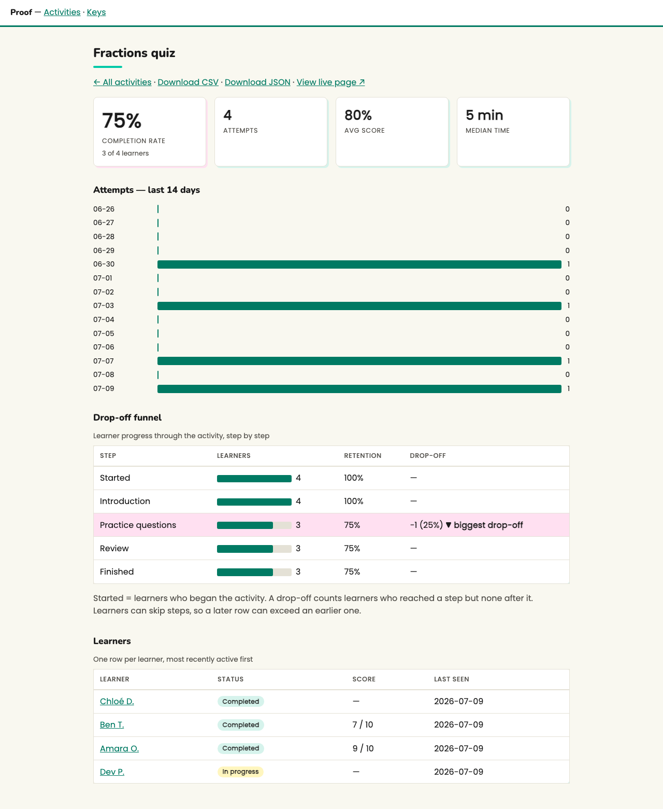

# Proof

See who did your learning activity, how they scored, and where they dropped off — on your own Cloudflare account, free. Proof is an open-source (MIT) results tracker for learning activities: no LMS, no subscription, no learner data leaving infrastructure you control.

## How it works

1. Deploy your instance (one click below, or CLI).
2. Add one script tag to any page — or paste one prompt into your AI builder, or add data-h5p to a page that already hosts H5P content.
3. Watch results land: completion rate, drop-off funnel, per-learner timelines, CSV export.

## Compared honestly

| | Proof | SCORM Cloud (free tier) | lrsql | Spreadsheet |
|---|---|---|---|---|
| Cost | Free, your Cloudflare account | Free to 10 registrations, then $40+/mo | Free, self-hosted | Free |
| Teacher-readable results | Yes — built for it | Reporting is the paid tier | Statement browser, not a dashboard | Manual entry |
| Standards | Honest xAPI subset (statements only) | Full LRS + SCORM | Full conformant LRS | None |
| Works with AI-built pages | One prompt (llms.txt) | Manual integration | Manual integration | Manual |

Need a full conformant LRS? Use [lrsql](https://github.com/yetanalytics/lrsql) — Proof's statements export/forward cleanly. More in the [embed guide](docs/embed.md) and the honest fine print on every instance's /about page.

## Status

v1 + insight/identity milestones shipped; tests + typecheck + axe gate are in place.

## Quickstart (local)

    pnpm install
    wrangler d1 migrations apply proof --local
    pnpm dev                # wrangler dev with a local D1

Mint an ingest key (admin password is the ADMIN_PASSWORD secret; use any
value with `wrangler dev --var ADMIN_PASSWORD:dev-password`):

    curl -X POST http://localhost:8787/admin/keys \
      -u admin:dev-password \
      -H "Content-Type: application/json" \
      -d '{"label":"my classroom"}'

Send a statement with the returned id/secret:

    curl -X POST http://localhost:8787/xapi/statements \
      -u <key-id>:<key-secret> \
      -H "X-Experience-API-Version: 1.0.3" \
      -H "Content-Type: application/json" \
      -d '{"actor":{"mbox":"mailto:me@example.org"},"verb":{"id":"http://adlnet.gov/expapi/verbs/completed"},"object":{"id":"https://example.org/my-activity"}}'

## Embed in any page

One script tag + four calls (`proof.start/step/answer/finish`) — see
[docs/embed.md](docs/embed.md). AI builders: point them at your instance's
`/llms.txt`, which contains paste-ready instructions.

## Read your results (humans, scripts, AIs)

Read keys are separate from ingest keys, so pages can write results without being able to read them back. The read API provides JSON summaries and paste-ready markdown reports; `llms.txt` documents those endpoints for AI builders, and [docs/api.md](docs/api.md) is the reference.

## Deploy

See [docs/deploy.md](docs/deploy.md). Production instances must set the `ADMIN_PASSWORD` secret:

    wrangler secret put ADMIN_PASSWORD

## Errors

Auth 401 responses return `{ "error": "Unauthorized" }`; other 4xx responses return `{ "error": "<plain-language reason>", "docs": "..." }`.
The version header `X-Experience-API-Version: 1.0.x` is required on
`/xapi/statements`.

## Development

    pnpm test        # vitest via @cloudflare/vitest-pool-workers (local D1)
    pnpm typecheck
    pnpm test:a11y   # Playwright + axe against wrangler dev (zero-violation gate)
    pnpm screenshot   # refresh docs/assets/dashboard.png

## License

MIT. Every source file carries an SPDX header.
